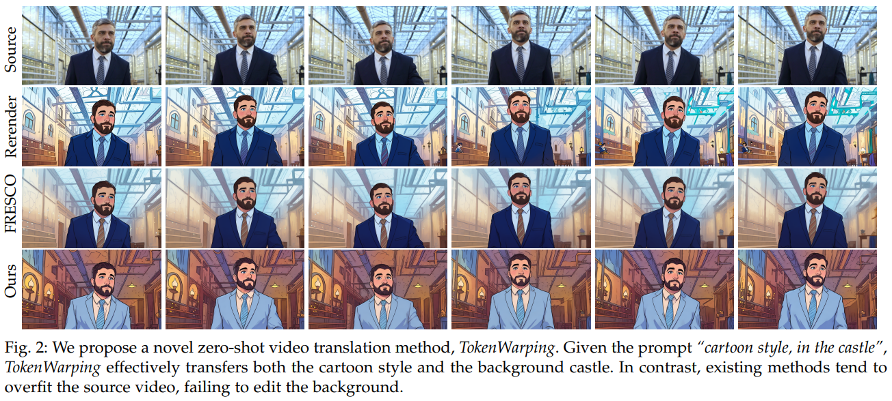

<p align="center">
  <a href="https://github.com/Alex-Zhu1/TokenWarping">
    
  </a>
</p>

<h1 align="center"><strong>TokenWarping</strong></h1>
<h3 align="center">Zero-Shot Video Translation via Token Warping in Self-Attention</h3>
<h4 align="center">IEEE TVCG 2025</h4>

<div align="center">

[](https://arxiv.org/abs/2507.09168)

</div>

<p align="center">
  ⚡ <strong>Training-free • Inversion-free • Zero-shot</strong> ⚡<br>
  Video-to-video translation via token warping inside self-attention
</p>


## Contents
<!-- - [Demo Videos](#demo-videos)
- [Release](#release) -->
- [Contents](#contents)
- [Installation](#installation)
- [Command Line](#command-line)
- [Citation](#citation)
- [Acknowledgement](#acknowledgement)

## Installation

Our environment was tested on Ubuntu 22, CUDA 11.7 with 3090.

We provide an [environment.yaml](https://github.com/Alex-Zhu1/TokenWarping/blob/main/environment.yaml) file to help you verify.

## Command Line

Please try our demo by running  
[`main_hack.py`](https://github.com/Alex-Zhu1/TokenWarping/blob/main/main_hack.py).

Due to limited GPU memory, we also provide a **batch-infer** mode for longer videos.  
To enable it, modify **main_hack.py** as follows:

```python
from infer_batch import main  # flow prediction uses 8-frame batch-infer
```

With batch-infer enabled, the pipeline can process up to ~120 frames on a typical GPU.

## Citation

If you find our work helpful in your project, please cite:

```BiBTeX
@misc{zhu2025stablescoredistillation,
      title={Stable Score Distillation}, 
      author={Haiming Zhu and Yangyang Xu and Chenshu Xu and Tingrui Shen and Wenxi Liu and Yong Du and Jun Yu and Shengfeng He},
      year={2025},
      eprint={2507.09168},
      archivePrefix={arXiv},
      primaryClass={cs.CV},
      url={https://arxiv.org/abs/2507.09168}, 
}
```

## Acknowledgement

Most of our code is adapted from the excellent works of [RFESCO](https://github.com/williamyang1991/FRESCO) and [ControlVideo](https://github.com/YBYBZhang/ControlVideo). We sincerely thank the authors for their great contributions.